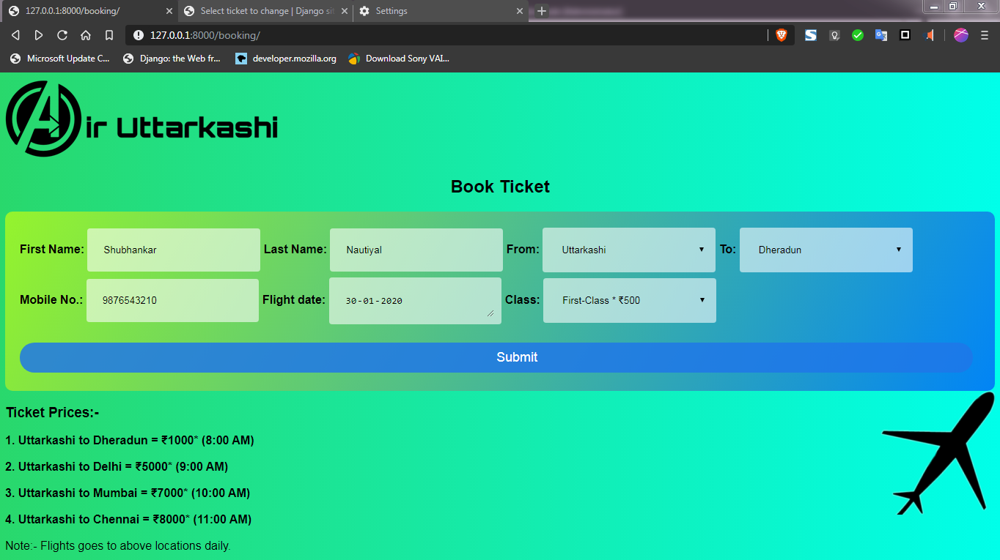
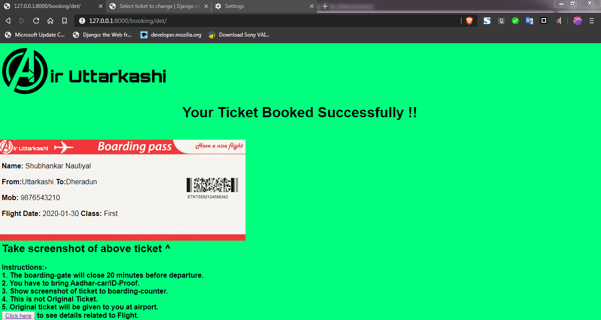
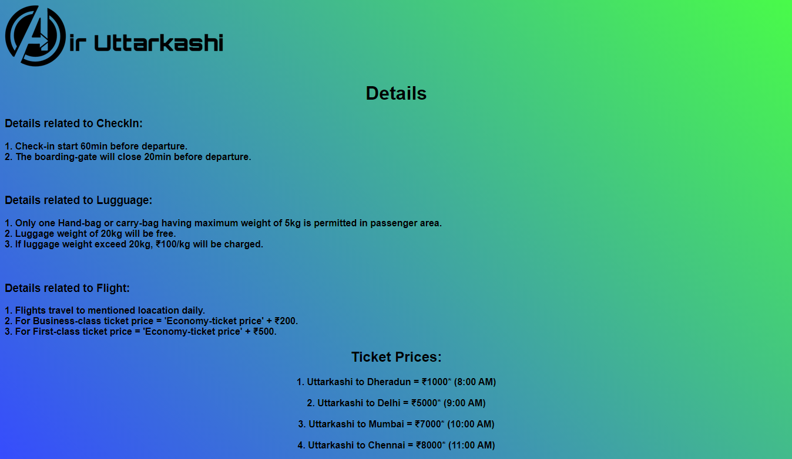

# AirUttarkashi (Django project)

This is my 12th grade project for school . 
This Project is Django based Flight Booking site.

#### Step 1- Clone repository to local drive.
#### Step 2- Open Terminal or Command promt and change directiory path to Project or simply press (shift + mouse right button) and select open command promt here (For Windows).
#### Step 3- Write - ( python manage.py runserver ) and you get url link or it automatically open in your default browser.

## Below are some ScreenShot of website.

## 1.Home Page

## 2.Booking Page

## 3.Ticket Page

## 4.Details Page

